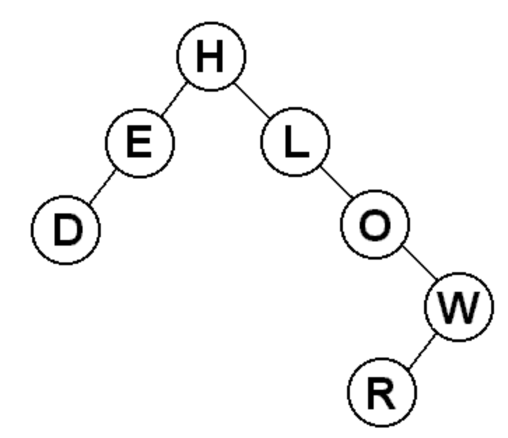
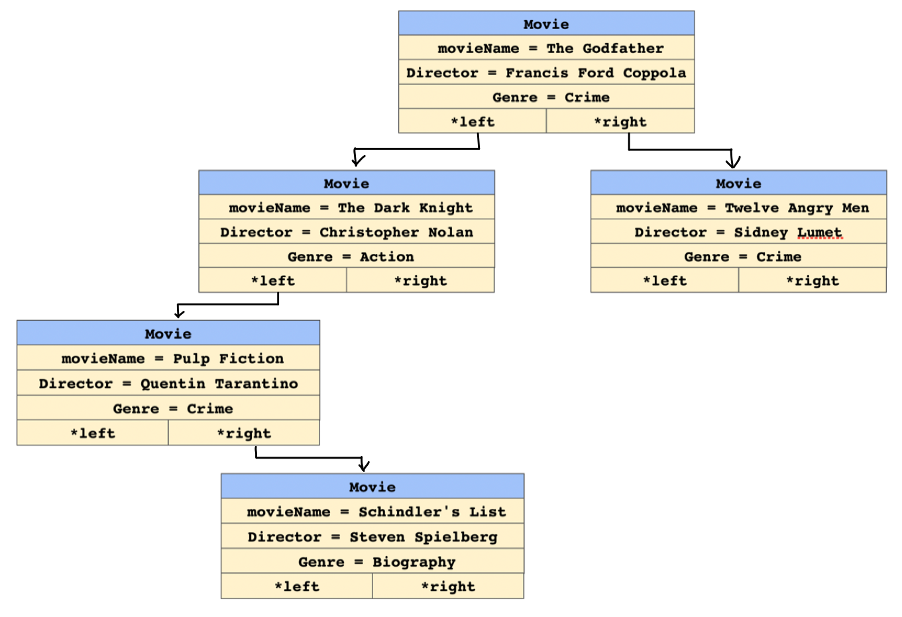
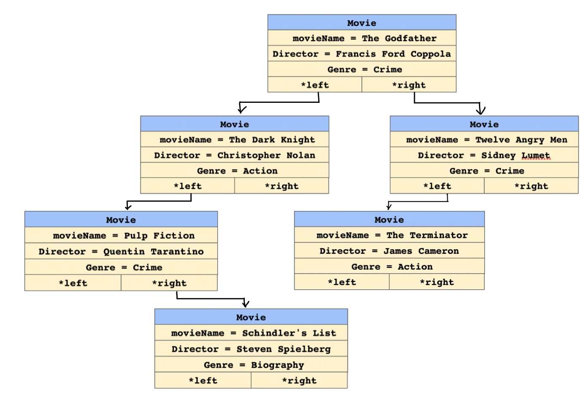
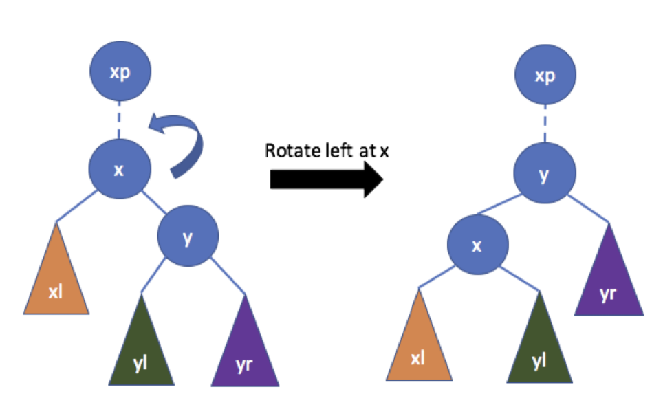
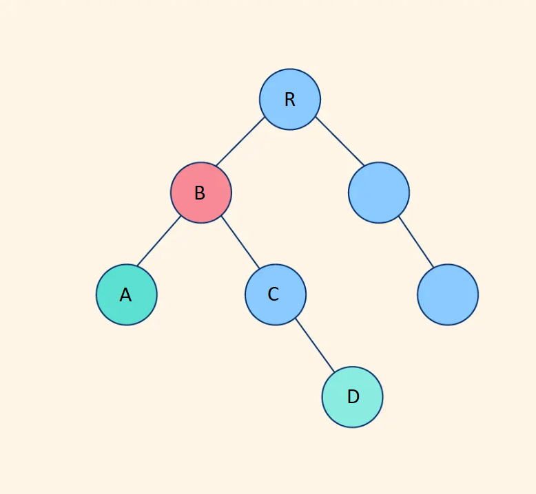

# CSCI 2270 – Data Structures - Assignment 7 - Binary Search Tree II

## Objectives

1. Given a Binary Search Tree (BST) perform the following operations on it
2. Remove a movie, rotate the tree and find the closest parent to two movies. 

## Instructions to run programs

Please read all the directions ​*before* writing code, as this write-up contains specific requirements for how the code should be written.

To receive credit for your code, you will need to pass the necessary test cases. Use the following steps to test your code as you work on the assignment:

 1. Open up your Linux terminal, navigate to the build directory of this assignment (e.g. `cd build`).
 2. Run the `cmake ..` command.
 3. Run the `make` command.
 4. If there are no compilation errors, two executables will be generated within the build directory: `run_app` and `run_tests`.
 4. If you would like to run your program, execute `run_app` from the terminal by typing `./run_app <Any Required Arguments>`.
 5. To run the grading tests, execute `run_tests` from the terminal by typing `./run_tests`.

## Background 
<details>
  <summary>Click to expand Homework 6 specifications</summary>

Binary Search Trees (BST) are very interesting data structures. Let's break down what they mean.

    1. Tree: A tree is a hierarchical data structure. Every node has zero or more children (where each child is also a node of the tree). It starts with a root node (start of the tree) and branches out to the leaf nodes(have no children).

    
    2. Binary: While a tree node can have any number of children, making it binary restricts the children to atmost 2. (So a node in a binary tree can have 0, 1 or 2 children only)


    3. Search: This is what makes a BST unique. BSTs have some rules in place which allow us to 'search' faster in our tree data structure. Let's look at these rules which must be honored by every node of a BST.
    (a) Each BST node must be associated with a key. This key could be an integer, string, float, etc.
    (b) For each node of the BST, ALL nodes in the left subtree must have key 'lesser' than the key of the node.
    (c) For each node of the BST, ALL nodes in the right subtree must have key 'greater' than the key of the node.
    (d) For this assignment, no two movies have the same `movieName`.

Based on this definition, the following is a letter BST example


 ## Overview
 
 In this assignment, you should store the information of some movies in a binary search tree. For each movie, we will store its name, author, and rating. A sample dataset from has been given in `movies.csv`. This is the definition of the `Movie` struct in `MovieCollection.hpp`:
```
 struct Movie {
    string movieName;
    string director;
    string genre;

    Movie* left = nullptr;
    Movie* right = nullptr;
};
```
The tree is such that all the children of a node on its left child's subtree have `movieName` alphabetically `smaller` than the parent node. Similarly, the children on the right subtree are alphabetically `larger`.

You can use the `movies.csv` file to test the functions, but you can run the program without it as well. If you want to use the dataset, simply add `../movies.csv` as an argument to `run_app`. You don't need to do this, and simply running it without any arguments will also work, but will start with an empty collection. 

Here are a few entries from the dataset:


| Name | Genre | Director
| --- | --- | --- |
The Godfather | Crime |	Francis Ford Coppola	|
The Dark Knight	| Action	| Christopher Nolan	|
Twelve Angry Men	|	Crime	|	Sidney Lumet	|
Pulp Fiction	|	Crime	|	Quentin Tarantino	|
Schindler's List	|	Biography	|	Steven Spielberg	|

If we add these items in the given order, the tree should be as follows: 

```Example 1```



**NOTE:** `app/main.cpp` file has been provided for you. Do NOT make any changes to the `app/main.cpp` file). For the described setting, you will have to implement the following #TODO functions in `code/MovieCollection.cpp`. 

### Constructor: MovieCollection()
Class constructor. Set the root of the tree to a `nullptr`.

### Destructor: ~MovieCollection()
Class destructor. Free all memory that was allocated and set root to `nullptr`. 

For any movies present in the collection, you need to recursively delete both the children and only then delete the current movie. If you delete the current movie first, `movie->left` and `movie->right` will become inaccessible.

### void addMovie(string movieName, string genre, string director)

Add a new movie to the collection based on the `movieName`. You should create a new `movie`, initialize it with the given information (movieName, genre and director), and add it to the tree. Your tree should still be a valid Binary Search Tree after the insertion. 

*Hint: you can compare strings with `<`, `>`, `==`, `string::compare()` function.*

**NOTE:** No two movies have the same `movieName`.

#### ```Example:```

If in the ```Example 1``` we add a new movie by calling the addMovie function as follows:


```
addMovie("The Terminator", "Action", "James Cameron");
```

The updated BST should look like:

```Example 2```




### showMovieCollection() 

Show all the movies added to the collection so far, in alphabetical order. You can use the following line of code to print all the information:

```
cout << "MOVIE: " << movie->movieName << " GENRE: " << movie->genre << " DIRECTED BY: " << movie->director << endl;
```

For ```Example 2``` above, you should print: 

```
MOVIE: Pulp Fiction GENRE: Crime DIRECTED BY: Quentin Tarantino
MOVIE: Schindler's List GENRE: Biography DIRECTED BY: Steven Spielberg
MOVIE: The Dark Knight GENRE: Action DIRECTED BY: Christopher Nolan
MOVIE: The Godfather GENRE: Crime DIRECTED BY: Francis Ford Coppola
MOVIE: The Terminator GENRE: Action DIRECTED BY: James Cameron
MOVIE: Twelve Angry Men GENRE: Crime DIRECTED BY: Sidney Lumet

```

If the collection is empty, print `cout << "Collection is empty." << endl;`

*Hint: to traverse the tree using preorder , for every node you need to first print the root, then all its descendents in the left subtree, and then every descendent in the right subtree.*


### void showMovie(string movieName)

In the `movieCollection`, search for a `movieName` matching the given `movieName`. If the movie is found, display its properties:

```
cout << "Movie:" << endl;
cout << "==================" << endl;
cout << "Name :" << movie->movieName << endl;
cout << "Genre :" << movie->author << endl;
cout << "Director :" << movie->rating << endl;
```
If the movie is not found in the collection, print `cout << "Movie not found." << endl;`

*Hint: You should utilize the properties of a Binary Search Tree, so that the search time is limited to O(log n). Starting from the root, at every node, if it doesn't match the given title, you shoud either choose to traverse the left subtree or the right subtree.*

#### ```Example:```

If in the ```Example 2``` we search using the following command: 


```
showMovie("Pulp Fiction");
```

You should output:
```
Movie:
==================
Name :Pulp Fiction
Genre :Crime
Director :Quentin Tarantino
```

If you search for:

```
showMovie("Deadpool2");
```

You should output:

```
Movie not found.
```
</details>


## Function you will have to implement in assignment 7 

For the described setting, you will have to implement the following #TODO functions in `code/MovieCollection.cpp`. You will have to create multiple helper functions to iterate through the tree (they are mentioned in the hint).


### void removeMovie(string movieName)

Remove the given ```movieName``` from the movie collection. You will have to take care of the following edge cases:

1. Leaf Node
2. Node having either only left or only right child
3. Node having both left and right child

#### ```Example```

Suppose in the following ```Example 3```, we want to remove the movie *The Terminator*.

```Example 3```


The collection before calling the function will look like:

```
MOVIE: Pulp Fiction GENRE: Crime DIRECTED BY: Quentin Tarantino
MOVIE: Schindler's List GENRE: Biography DIRECTED BY: Steven Spielberg
MOVIE: The Dark Knight GENRE: Action DIRECTED BY: Christopher Nolan
MOVIE: The Godfather GENRE: Crime DIRECTED BY: Francis Ford Coppola
MOVIE: The Terminator GENRE: Action DIRECTED BY: James Cameron
MOVIE: Twelve Angry Men GENRE: Crime DIRECTED BY: Sidney Lumet

```

We will call the remove function ```removeMovie("The Terminator");```. After removing, the tree is like:


The updated MovieCollection tree should look like

```
MOVIE: Pulp Fiction GENRE: Crime DIRECTED BY: Quentin Tarantino
MOVIE: Schindler's List GENRE: Biography DIRECTED BY: Steven Spielberg
MOVIE: The Dark Knight GENRE: Action DIRECTED BY: Christopher Nolan
MOVIE: The Godfather GENRE: Crime DIRECTED BY: Francis Ford Coppola
MOVIE: Twelve Angry Men GENRE: Crime DIRECTED BY: Sidney Lumet

```


If the movie is **_not present_**, then you need to print ```cout << "Movie not found!" << endl;``` 

#### ``` Example ```

```removeMovie("The Lord of the Rings");```

The output for this should be

``` "Movie not found!" ```

*Hint: For this function you would want to create a helper function to find the minimum node in the right-subtree.*


### void rotateLeftCollection(string movieName)

Rotate the node with the given movieName to the left. You can refer to the given illustration. 


Rotate the node with the given movieName to the left. In the given illustration, left rotation is being performed on node x.

1. Set the Parents pointers accordingly
   - Parent of x becomes the parent of y
   - y becomes the new parent of x
2. Set the subtree (left and right children) pointers accordingly
   - The left subtree of y becomes the right subtree of x
   - x and its descendants become the left subtree of y
3. If x was the left (or right ) subtree of xp (parent of x), make y the left (or right) subtree of xp respectively. This can be checked by comparing the movie names of the parent (xp) and the child (y).
4. Check the boundary conditions
   - x is root
   - x has no right child




*Hint: For this function you would want to create helper function (findParent) which returns the pointer to parent node of x (xp) and another helper function which returns the node x, so that its easy change the subtrees of nodes x, y and xp.*


### string closestParent(string movie1, string movie2)

Given two movies you will have to find the closest common parent. 

#### ```Example```

Suppose in Example 3, you want to find the lowest/latest parent for movie *Pulp Fiction* and *Twelve Angry Men*. The closest parent for both of these movie will be the root node which is *The Godfather*. The output will be **Note: The cout statement for this output is already present in main, you just have to return the parentMovie**:

``` The closest parent to both movies is: The Godfather ```

#### ```Example```

Suppose the movie you input is not present in the collection, eg: *movie2 = The Lord of the Rings*. You will print out ```cout << "Movie not found!" << endl;``` and return ``` parentMovie = Error - wrong movie name```.

For input:
```
Enter the name of the first movie (Movie1):
Pulp Fiction
Enter the name of the second movie (Movie2):
The Lord of the Rings
```

Your output will look as follows:
```
Movie not found!
The closest parent to both the movies is: Error - wrong movie name
```


*Hint: For this function, you would want to create helper functions that find the path to a certain movieName and store it in an array.*

In the tree below, suppose you want to find the closest parent to node A and D. For that, you need to first find the path to movie1 and movie2 from the root. In the illustration below, the path for A is:
```
R -> B -> A
```
and the path for D is:
```
R -> B -> C -> D
```
Once the two paths are known, we can simply look for the last element that is in both the paths, in this case B. That element will then be the closest parent. 
Note that you are only to **return the movieName** of the node and not the pointer to the node.




### Submitting your code:
Write your code and push the changes to your private repository. Log onto Canvas and go to Assignment 7. Paste your GitHub repository link and submit.

### Appendix
You will have to traverse through the collection by calling a helper function. For example, if you want to reach the leaf nodes of the trees you will implement it in the following way:

```
void MovieCollection::leafNode()
{
    leafNodeHelperFunction(root);
}

void leafNodeHelperFunction(Movie* currNode)
{
    if(currNode!=nullptr)
    {
        if(currNode->left == nullptr && currNode->right == nullptr)
        {
            //reached the leaf node - now you can print whatever you want and do whatever
            cout << currNode->movieName << endl; // leaf node movie
            return;
        }
        // These two lines will recursively call the left and right sub-tree respectively. 
        // You can go to the bottom of the tree by calling the same function on the current nodes left and right children
        leafNodeHelperFunction(currNode->left);
        leafNodeHelperFunction(currNode->right);
    }
}
```
